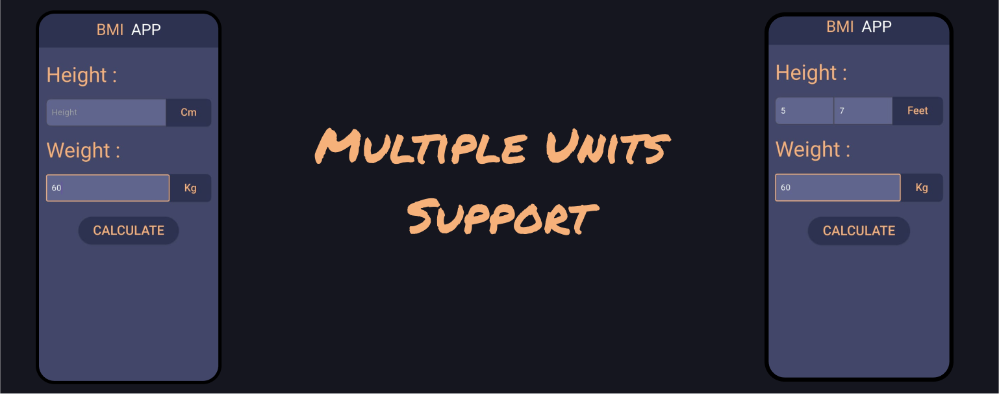
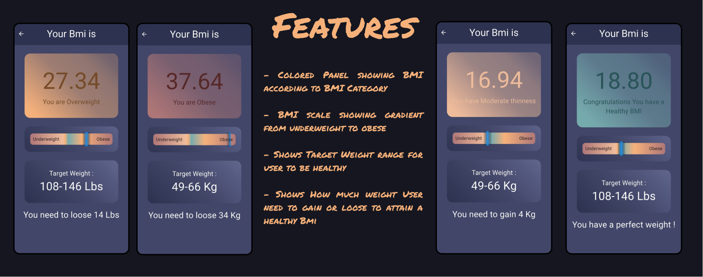

# App to Calcualte BMI

## Features :
- Multiple Units for height
- Mulitple Units for Weight
- Colored Panel showing BMI according to BMI Category
- BMI scale showing gradient from underweight to obese
- Shows Target Weight range for user to be healthy
- Shows How much weight User need to gain or loose to attain a healthy Bmi

